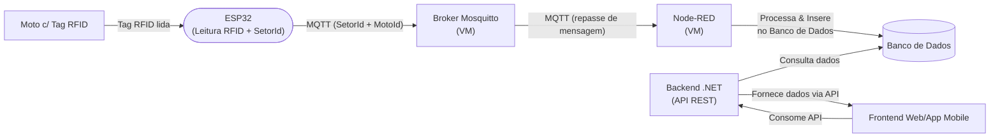

# 📡 iot-ondetamoto

Projeto de IoT para rastreamento de entrada e saída de motos via RFID, desenvolvido como solução para problemas de organização de frotas na startup **Mottu**.

---
## 🧑‍💻 Equipe

- Guilherme Romanholi Santos - RM557462
- Murilo Capristo - RM556794
- Nicolas Guinante Cavalcanti - RM557844

---

## 📋 Como testar o projeto

### 🖥️ 1. Suba a VM no Azure

Execute os comandos listados no arquivo `azure.txt` (fornecido na entrega) para iniciar a máquina virtual com:

- Mosquitto (broker MQTT)
- Node-RED

> A VM será responsável por receber dados do ESP32 e repassar ao backend (em construção).

---

### 📦 2. Clone o repositório

```bash
git clone https://github.com/Murilo-Capristo/iot-ondetamoto
cd iot-ondetamoto
```

---

### 📲 3. Rode o aplicativo mobile

O app foi desenvolvido em **React Native com Expo**.

##  Como Rodar o Projeto?
```bash

- git clone https://github.com/Murilo-Capristo/sc-3-ondetamoto.git
- cd sc-3-ondetamoto
- npm i
- npx expo start

```

Use o aplicativo **Expo Go** no celular para escanear o QR Code.

---

### 🤖 4. Simule o hardware com Wokwi

O ESP32 simula a leitura de tags RFID.

1. Acesse [https://wokwi.com](https://wokwi.com)
2. Crie um novo projeto
3. Substitua o conteúdo pelo código da pasta:

```
Esp-32-Wokwi/
```

Bibliotecas Necessárias:
1. PubSubClient

No terminal serial do Wokwi, digite manualmente os IDs simulando a leitura de tags.

---


## 🧱 Arquitetura da Solução



## ✅ Funcionalidades implementadas

- Simulação de leitura RFID via ESP32
- Publicação MQTT no tópico `rfid-moto/leituras`
- Processamento da mensagem no Node-RED
- Interface web com histórico de leituras
- App mobile com verificação de entrada/saída de motos
- Backend em .NET com API REST
- Integração com banco de dados

---


